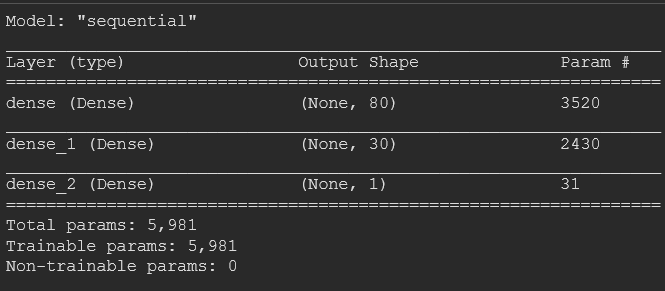

# Neural_Networks

## Overview of the analysis

We are analyzing a dataset from a charity named Alphabet Soup, using the basic neural network models to design a binary classifier that will help us determine whether applicants will be successful if funded by Alphabet Soup. In doing this, we are first creating a neural network that will train on the data and will try to predict outcomes as to whether they are successful or not. Furthermore, we will try to optimize the neural network model so that our predictions can be improved.

## Results

During our data preprocessing part, the following were identified and done:

- Our <b>target</b> feature is the column <b>IS_SUCCESSFUL</b>, which indicates whether a funding events desired outcome was achieved or not.
- Our Independent features are all the columns of the dataset <b>except</b> the IS_SUCCESSFUL column.
- The only columns that can be safely dropped as they do not impact any decisions are the <b>EIN</b> and <b>Name</b> column.
- The categorical columns were encoded so that they had numerical representation in the dataset
- Finally, the data was split into a training and testing cluster, and they were scaled as a normal distribution.

For our compiling, training and predicting, the below steps were taken:

- A neural network model was selected with <b>2 hidden layers</b>, with the first one having 80 neurons and the second one having 30 neurons. This is because we have 43 feature columns, so having triple the input makes the training go that much better. The activation functions used were <b>relu</b> or rectified linear activation function, as this is the easiest function for training the model, and the sigmoid function for the output layer, as this makes it more linear for the predictions. This resulted in achieving a prediction accuracy of 72.49% 

</img>

- Although the model was designed with the intention to achieve at least 75% prediction accuracy, the neural network was unable to achieve the target performance. This can be due to different reasons, not all of which can be addressed with a neural network.

- To increase the model performance, the following steps were taken to see if they improve the prediction score:
    - <b>Increasing the neurons</b> for the model to 100 for the 1st layer and 40 for the second layer;
    - <b>Increasing the number of hidden layers</b>, so that there were more back propagation for the input to go through;
    - Changing the activation function from relu to <b>tanh</b>, so that the analysis is done differently than before.

Unfortunately, none of these techniques seemed to improve the result of the models prediction accuracy. This indicates that the dataset analyzed has noisy data, which needs to be corrected from the collection source, or there is not enough information to predict the outcome properly.

## Summary

Overall, the neural network model was able to achieve a prediction score of 72.85% with tuneups, but was still short of the intended 75% target score. This means there will be a significant amount of predictions which will be wrong. One recommendation to solve this classification problem can be to use a different model like Random Forest Classifier. This can train on the data much faster, and there is less resources and coding required for this to be set up.